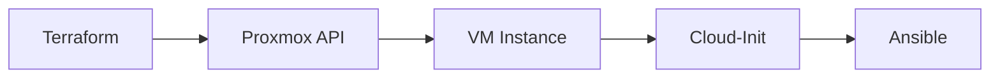

# Feature Design: [Feature Name]

## Metadata
- Author:
- Created:
- Status: [Draft/In Review/Approved/Implemented]
- Related issues/PRs:

## Goals and Motivation
Explain why this feature is needed and what problem it solves.

Problem: Describe the current problem or need

Proposed Solution: Short description of the approach

Benefits:
- Benefit 1
- Benefit 2

## Requirements

### Functional Requirements
- FR-1: Requirement 1
- FR-2: Requirement 2
- FR-3: Requirement 3

### Non-Functional Requirements
- Performance: e.g., exec time, resource usage
- Security: secrets handling, API access
- Reliability: error handling, fallback mechanisms
- Scalability: expected growth, constraints
- Maintainability: documentation, complexity, tech debt

## Assumptions and Constraints

Assumptions:
- Assumption 1
- Assumption 2

Constraints:
- Constraint 1
- Constraint 2

Out of Scope:
- What is explicitly not included

## Architecture and Design

### Components
Describe the main components and their responsibilities.

Component 1: [Name]
- Purpose:
- Responsibilities:
- Interactions:

Component 2: [Name]
- Purpose:
- Responsibilities:
- Interactions:

### Dependencies
List project dependencies (with versions and usage-spec links).

| Dependency | Version | Usage Spec | Purpose |
|------------|--------:|-----------|---------|
| Terraform CLI | ≥ 1.3.0 | `.tessl/usage-specs/tessl/terraform-cli/` (if installed) | Infra provisioning |
| Ansible Core | 2.19.1 | `.tessl/usage-specs/tessl/pypi-ansible-core/` | Post-configuration |

New dependencies (if any):
- Dependency 1: purpose
- Dependency 2: purpose

### Diagrams
Add sequence/component/deployment diagrams if helpful.

Example (Mermaid):


### File Layout Changes
Document structural changes:

```
proxmox-iac/
├── terraform/
│   ├── modules/
│   │   └── [new-module]/
│   │       ├── main.tf        # new
│   │       └── variables.tf   # new
│   └── main.tf                # modified
├── cloud-init/
│   └── templates/             # new folder
│       ├── web-server.yml     # new
│       └── database.yml       # new
└── docs/
    └── features/
        └── [this feature]/
            ├── design.md      # this document
            └── todo.md        # TODO checklist
```

## Implementation Stages

### Stage 1: [Name]
Description: What will be accomplished in this stage

Tasks:
- Task 1.1
- Task 1.2
- Task 1.3

Expected Outcome:
- What should work by the end of the stage

Exit Criteria:
- [ ] Criterion 1
- [ ] Criterion 2
- [ ] Validation tests pass

Dependencies: What must be done first

Estimate: Rough duration

---

### Stage 2: [Name]
Description

Tasks:
- Task 2.1
- Task 2.2

Expected Outcome:

Exit Criteria:
- [ ] Criterion 1
- [ ] Criterion 2

Dependencies: Stage 1

Estimate:

---

### Stage 3: Finalization
Description: docs, tests, code review

Tasks:
- Update documentation
- Run full test suite
- Code review
- Update KNOWLEDGE.md
- Update .tessl/project/spec.md

Exit Criteria:
- [ ] All tests pass
- [ ] Documentation updated
- [ ] Code review approved
- [ ] Merged to main

## Risks and Mitigations

| Risk | Likelihood | Impact | Mitigation |
|------|------------|--------|------------|
| Missing usage-spec for new dependency | Medium | Medium | Use official docs; add notes to KNOWLEDGE.md |
| Version conflicts | Low | High | Test in isolated env; verify compatibility upfront |
| Proxmox API changes | Low | High | Pin version; monitor changelog |
| Insufficient docs | Medium | Medium | Document during implementation; leverage usage-specs |

## Acceptance Criteria
- [ ] AC-1: Functionality matches requirements
- [ ] AC-2: Tests (unit/integration) pass
- [ ] AC-3: Documentation updated (README, KNOWLEDGE.md, usage-spec references)
- [ ] AC-4: Security policies satisfied (secrets, tokens)
- [ ] AC-5: Best practices from usage-spec followed
- [ ] AC-6: Edge cases handled
- [ ] AC-7: Performance goals met

## Testing

Test Scenarios:

Scenario 1: [Name]
- Preconditions:
- Steps:
  1. Step 1
  2. Step 2
- Expected:

Scenario 2: [Name]
- Preconditions:
- Steps:
- Expected:

Commands:
```bash
# Terraform
just tf-validate
just tf-plan
just tf-apply
just tf-destroy  # if rollback required

# Ansible
just ansible-post

# Verification
ssh user@vm-ip "command to verify"
```

## Artifacts

New files:
- `terraform/modules/[module-name]/main.tf`
- `cloud-init/templates/[template-name].yml`
- `docs/features/[feature-name]/design.md`
- `docs/features/[feature-name]/todo.md`

Modified files:
- `terraform/main.tf`
- `terraform/variables.tf`
- `terraform/terraform.tfvars.example`
- `KNOWLEDGE.md`
- `.tessl/project/spec.md`
- `.tessl/framework/usage-specs.md`
- `README.md`
- `Justfile` (if new recipes)

Removed files:
- [if applicable]

## References
- Project Spec: `.tessl/project/spec.md`
- Knowledge Index: `KNOWLEDGE.md`
- Tessl Guide: `.tessl/project/TESSL_GUIDE.md`
- Terraform Docs: https://terraform.io/docs
- Proxmox API: https://pve.proxmox.com/pve-docs/api-viewer/
- Cloud-Init: https://cloudinit.readthedocs.io/
- Ansible: https://docs.ansible.com/