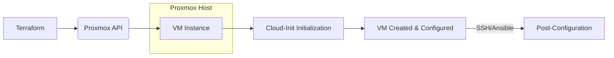

# 🧱 Proxmox VM Automation — Terraform + Cloud-Init

## Overview

This Infrastructure as Code (IaC) project automates the creation and initial configuration of virtual machines (VMs) on Proxmox Virtual Environment using Terraform, Cloud-Init, and optionally Ansible.

The project provides a modular, reproducible approach to VM provisioning that can be adapted for various use cases and operating systems.

## Architecture

The project uses a three-tier automation approach:

| Component | Role |
| :--- | :--- |
| **Terraform** | Infrastructure provisioning tool that uses the Proxmox API to create and configure VMs (CPU, RAM, disk, network) |
| **Cloud-Init** | Built-in Proxmox mechanism for **initial system configuration** during first boot (hostname, user creation, package installation, updates) |
| **Ansible (optional)** | Used for **post-configuration** after the VM is network-accessible. Handles complex setup tasks like installing applications, configuring services, etc. |

**Deployment Flow:**

## Usage

To deploy a VM, follow this workflow:

1. **Configure variables**: Create `terraform/terraform.tfvars` and fill in your Proxmox API credentials and VM specifications
2. **Initialize Terraform**: `just tf-init`
3. **Validate**: `just tf-validate`
4. **Plan**: `just tf-plan`
5. **Create VM**: `just tf-apply`
6. **Post-configuration (optional)**: `just ansible-post`

## Terraform Variables

| Variable | Description | Example |
| :--- | :--- | :--- |
| `pm_api_url` | Proxmox API URL | `https://proxmox.example.com:8006/api2/json` |
| `pm_user` | Proxmox username | `root@pam` |
| `pm_api_token_id` | API token ID | `terraform@pam!iac` |
| `pm_api_token_secret` | API token secret | (variable) |
| `target_node` | Proxmox node name | `node1`, `Gemini`, etc. |
| `vm_name` | VM name in Proxmox | `my-vm` |
| `vm_hostname` | VM hostname (optional, defaults to vm_name) | `my-hostname` |
| `template` | Cloud-Init template to clone from | `rocky9-cloudinit-template` |
| `cpu_sockets` | Number of CPU sockets | `1` |
| `cpu_cores_per_socket` | Cores per socket | `2` |
| `memory_mb` | Memory in MB | `2048` (2 GB) |
| `disk_gb` | Disk size in GB | `20` |
| `network_bridge` | Network bridge | `vmbr0` |
| `cloudinit_user` | Default user created by cloud-init | `rocky` |
| `ssh_public_key_path` | Path to public SSH key | `~/.ssh/id_ed25519.pub` |

## Cloud-Init Configuration

Cloud-Init configuration is passed via Terraform variables (`ciuser`, `sshkeys`, `ipconfig0`). The `cloud-init/cloud-init.yml` file serves as a reference template.

## Example Terraform Resource

See `terraform/main.tf` for the complete configuration.

## Requirements

- **Terraform** ≥ 1.3.0
- **Proxmox VE** with API access
- **Cloud-Init template** VM (must exist in Proxmox)
- **SSH key** (optional but recommended)
- **Ansible** (optional, for post-install automation)
- **Just** command runner (optional; can run commands directly)

## License

This IaC project is open source. Modify as needed for your environment.

## Documentation

- Tessl framework guide: `.tessl/project/TESSL_GUIDE.md`
- Project specification: `.tessl/project/spec.md`
- Knowledge Index: `KNOWLEDGE.md`
